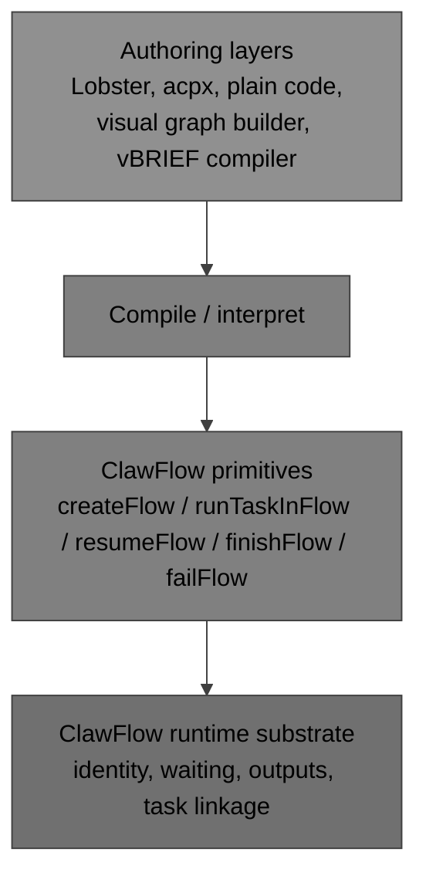
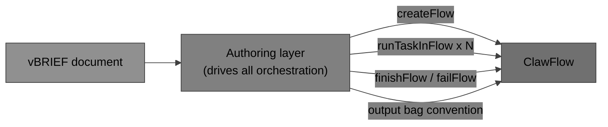
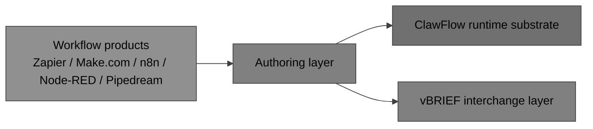
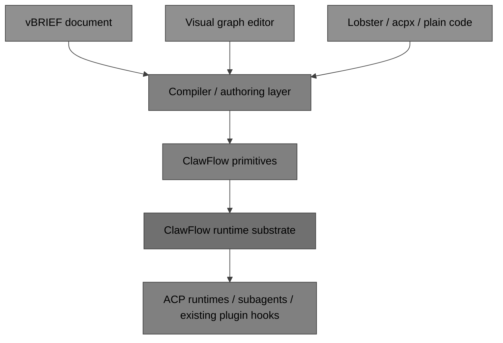

# ClawFlow Opportunity Plan for vBRIEF Workflow Execution

## Overview
This document makes the case for pairing **vBRIEF** with **ClawFlow** to give OpenClaw a portable, interoperable workflow execution story.

vBRIEF is a portable workflow definition and interchange format. ClawFlow is OpenClaw's durable execution runtime. Together they create a clean two-layer stack: vBRIEF and other authoring tools define *what* a workflow is; ClawFlow and its runtime SDK handle *how* it executes durably, including waiting, outputs, task linkage, and recovery.

The goal is not to add a new kind of engine to OpenClaw. The goal is to give OpenClaw a portable authoring layer above the substrate it already has, so workflows can be defined, shared, generated by agents, stored in Git, and moved between tools — while ClawFlow keeps doing what it does well.

## Opportunity statement
OpenClaw already has a durable execution substrate in ClawFlow and a growing plugin runtime SDK surface in `api.runtime.flow`. What it does not yet have is a portable, tool-neutral way to *define* and *author* workflows at the level above that substrate.

vBRIEF fills that gap. It provides a portable authoring and interchange format that can compile down to ClawFlow primitives such as `createFlow`, `runTaskInFlow`, `resumeFlow`, `finishFlow`, and `failFlow`, without changing what ClawFlow itself is.

The architectural model is intentional: ClawFlow is not the graph orchestration layer — it is the durable execution substrate underneath that layer. That is a strength, not a limitation. It means graph logic, branching, visual editing, and portability can all live in purpose-built authoring layers above ClawFlow without coupling them to the runtime persistence model.

## Why this is attractive for OpenClaw
- It preserves a clean architectural boundary. ClawFlow stays small, durable, and runtime-focused.
- It lets multiple authoring layers coexist. Lobster, acpx, plain code, and a future visual graph tool can all target the same runtime substrate.
- It gives OpenClaw portability without coupling portability to runtime internals. vBRIEF can be the interchange format without becoming the persisted runtime state model.
- It avoids duplicating plugin machinery. A graph authoring tool can use the existing ACP runtime and subagent integration hooks rather than requiring a new ClawFlow-specific plugin API.
- It creates a stronger ecosystem story. OpenClaw can offer a durable runtime core plus multiple ways to author workflows above it.
- It improves the agent story. LLMs can emit vBRIEF or other higher-level workflow descriptions, and the compiler layer can lower them into ClawFlow calls.

## Strong foundation already in place
The current runtime-substrate work already provides the pieces that an authoring layer needs:
- Flow lifecycle primitives already exist. `createFlow`, `resumeFlow`, `finishFlow`, and `failFlow` are the correct durable control points.
- Explicit waiting already exists. That gives higher layers a reliable substrate for approvals, callbacks, async tasks, and blocked states.
- Output persistence already exists. Higher layers can map workflow node or port outputs onto that persisted runtime data.
- Task linkage already exists. This is the right base for compiled workflow steps and agent task execution.
- The existing ACP runtime and subagent/plugin system already exists. A graph authoring layer can reuse those hooks instead of inventing a second plugin API at the ClawFlow layer.

### api.runtime.flow — an even stronger foundation than expected
PR #59110 ("Plugins: add bound flow runtime") introduces `api.runtime.flow`, a **bound flow runtime SDK surface** in the plugin system. This is directly relevant to the plan here.

`createRuntimeFlow()` returns a `PluginRuntimeFlow` with two entry points:
- `bindSession` — for trusted callers with an existing OpenClaw session key
- `fromToolContext` — for tool-context-aware binding

Each produces a `BoundFlowRuntime` that scopes all flow reads and lifecycle mutations to the bound owner key without exposing owner parameters at the call site. The surface includes: `get`, `list`, `findLatest`, `resolve`, `runTask`, `setWaiting`, `resume`, `finish`, `fail`, `requestCancel`.

This is important for two reasons:
1. An authoring/compiler layer implementing vBRIEF execution **already has a clean, owner-scoped SDK surface to call into** — it does not need to work against raw ClawFlow primitives or invent its own session management.
2. `setWaiting` is part of the surface. Whether it is expressive enough for typed wait reasons (approvals, external callbacks, upstream dependencies) is still worth evaluating, but the mechanism is present.

One rough edge worth noting: `cancel` currently requires a caller-supplied `OpenClawConfig`, which breaks the bound-session encapsulation pattern. A code reviewer flagged this as a minor inconsistency. If that is resolved, the surface becomes fully uniform.

In other words, the opportunity is not to turn ClawFlow into a monolithic workflow product. The opportunity is to make it the durable execution core that multiple workflow authoring layers can target — and the plugin SDK is already moving in that direction.

## Capability matrix

### ClawFlow already provides the right substrate
- Durable flow identity
- Explicit runtime waiting
- Persisted outputs
- Task linkage
- Terminal completion and failure
- Integration with the existing ACP runtime / spawn / subagent model

### Likely high-value substrate improvements
- External task completion hook for approval/callback gates (if not already supported by the task model)
- Better runtime metadata projection for higher-level node status views
- Better child-flow or sub-flow linkage where needed
- Better exportable run metadata for observability and round-trip tooling
- Note: output structure is handled by compiler-layer key conventions on the existing bag — no substrate change needed

### Capabilities that belong above ClawFlow
- Graph scheduling
- Branch and merge semantics
- Node and edge models
- Port validation and routing
- Expression evaluation
- Visual editing
- Workflow import/export and interchange

## What ClawFlow itself needs for this plan to work

### Can we build an MVP without any ClawFlow changes?

**Yes.** A Phase 1 MVP covering sequential workflows and simple branching requires zero changes to ClawFlow itself.

The authoring/compiler layer drives all orchestration:
- It parses the vBRIEF document and resolves the execution order
- It calls `createFlow` to start a run
- It calls `runTaskInFlow` for each node in sequence
- It stores node outputs in the existing output bag using a key convention such as `node:<id>:<port>` — no ClawFlow change needed
- It tracks node-level state in its own layer, not in ClawFlow
- It calls `finishFlow` or `failFlow` at the terminal point
- For simple branching, it evaluates the branch condition and calls `runTaskInFlow` for the appropriate next node

With `api.runtime.flow` (PR #59110) providing a clean, owner-scoped SDK surface, the authoring layer does not need to manage raw owner keys or invent session handling. It binds to a session or tool context and calls the SDK directly.

### What are the most surgical changes to support all vBRIEF features?

Most of the full vBRIEF Workflow Profile — DAG scheduling, fan-out, fan-in, parallel execution, merge nodes, port routing, edge conditions, expressions, and retries — all live in the authoring layer with no ClawFlow changes required.

The only things that genuinely need a ClawFlow or SDK touch for full vBRIEF support are three small, targeted items:

**1. External task completion (if not already supported)**

vBRIEF has four distinct wait categories:
- **task** — waiting for a ClawFlow task to complete (already handled by `setWaiting(taskId)`)
- **approval** — a human decision gate
- **callback** — the flow is waiting for an inbound external event such as a webhook or payment confirmation
- **upstream** — a merge node waiting for multiple parallel branches to converge

The cleaner solution is not to extend `setWaiting` with typed metadata, but to model each wait kind as a task:
- For **approval** and **callback** waits: the authoring layer calls `runTaskInFlow` to create a placeholder task representing the gate, then calls `setWaiting(taskId)` with that ID. When the approval is given or the external event fires, that task is marked complete externally, and the flow resumes. `setWaiting` needs no changes.
- For **upstream/merge** waits: the authoring layer controls execution order and simply does not call `runTaskInFlow` for the merge node until all prerequisite tasks have completed. No `setWaiting` call is needed at all.

This means the task model already handles all four categories cleanly *if* tasks support external completion — being marked complete by an outside caller rather than by ClawFlow internally running an execution unit.

*What may be needed:* A lightweight mechanism for an external caller to mark a task as complete (e.g., a callback handler completing an approval task when a human submits approval, or an inbound webhook handler completing a callback task). If this already exists or is easy to add at the task level, `setWaiting` requires no changes at all for full vBRIEF support.

**2. `cancel` encapsulation on `BoundFlowRuntime`**

*What:* Accept `OpenClawConfig` at `bindSession` / `fromToolContext` time so it is captured in the closure rather than required as a parameter on every `cancel` call.

*Why:* `BoundFlowRuntime` is built around a single binding contract: bind context once, call cleanly thereafter. Every other method (`get`, `list`, `runTask`, `setWaiting`, `resume`, `finish`, `fail`, `requestCancel`) honours this — callers pass no session or config arguments after binding. `cancel` is the lone exception: it requires `OpenClawConfig` at the call site.

For a vBRIEF compiler this is a real problem. Cancellation is triggered from error handlers, timeout paths, and failure propagation — often deep inside compiled node execution. If each of those call sites must supply `OpenClawConfig`, the compiler has to either thread it through every layer of compiled execution, store it as a module-level global (unsafe), or re-resolve it on demand (fragile). The bound context that `bindSession`/`fromToolContext` already captures is exactly where `OpenClawConfig` belongs. This is a one-time cleanup, not an architectural change.

**3. Child-flow linkage for sub-workflows**

*What:* When creating a child flow for a sub-workflow invocation, record `parentFlowId` either as a metadata convention on the output bag (e.g. key `_meta:parentFlowId`) or as a small optional field on flow creation.

*Why:* vBRIEF supports sub-workflow invocation — one workflow calls another as a nested execution unit. Without any parent-child linkage at the ClawFlow level, three things break:

- **Cancellation propagation**: cancelling a parent flow has no mechanism to reach running child flows. The authoring layer would have to track every child ID in-memory and manually cancel each one — which is fragile and does not survive a process restart or crash.
- **Observability**: listing or inspecting a parent flow gives no indication that child flows exist or what state they are in. The execution tree is invisible.
- **Export fidelity**: reconstructing a workflow run back to vBRIEF format (for history, debugging, or tooling) requires the full execution tree. Without linkage there is no tree, just a flat list of disconnected flows.

The output-bag convention approach (store `_meta:parentFlowId` in the child flow's bag) works for MVP at zero ClawFlow cost. For full support — especially cascaded cancellation — a native `parentFlowId` field on flow creation is the cleaner path because ClawFlow can enforce the relationship rather than treating it as opaque data.

Those three items are the complete set of surgical changes needed to go from MVP to full vBRIEF feature support. Item 1 may already be a non-issue if ClawFlow tasks already support external completion, in which case the list reduces to two items.

### Explicitly not needed in ClawFlow itself
To make the boundary clear, the following do **not** need to move into ClawFlow:
- DAG scheduling
- branch activation and merge semantics
- node and edge graph models
- port validation and routing
- expression evaluation
- visual editing
- a separate ClawFlow-specific plugin API

All of that belongs in the authoring/compiler layer, using `api.runtime.flow` and the existing ACP runtime and subagent/plugin integration points.

## Competitive positioning
The most useful way to position this work is not “ClawFlow should become another Zapier or n8n internally.” The better framing is that OpenClaw can separate the stack more cleanly than many workflow products do.

In this section, **Make.com** refers to the workflow automation service, not the `make` build tool.

### Current ClawFlow
Current ClawFlow compares best to the runtime substrate that sits underneath workflow tools, not to the entire product surface of those tools.

- Compared with **Zapier**, current ClawFlow is not a turnkey SaaS automation product, and that is fine. Zapier optimizes for app connectivity and managed no-code experience. ClawFlow is more interesting as the durable execution core beneath a higher-level authoring tool.
- Compared with **n8n**, current ClawFlow is intentionally below the graph editor and workflow-definition layer. n8n packages authoring and execution together. ClawFlow currently focuses on the execution side of that stack.
- Compared with **Make.com**, current ClawFlow is not the visual scenario builder. Make.com is the authoring and product surface; ClawFlow is closer to the durable runtime below that kind of surface.
- Compared with **Node-RED**, current ClawFlow is not the self-hosted flow-based programming UI and node ecosystem. It is the lower execution layer that a more specialized OpenClaw-native authoring tool could target.
- Compared with **Pipedream**, current ClawFlow is still closer to runtime infrastructure than to hosted workflow authoring. The similarity is that both value durable execution primitives; the difference is that Pipedream also ships a mature workflow product around them.

### Enhanced ClawFlow substrate
The next step for ClawFlow is not “become the graph engine.” It is “become an even better substrate for graph engines and other authoring layers.”

- Compared with **Zapier** or **Make.com**, the differentiator is not UI parity. It is a cleaner split between durable runtime state and authoring-time workflow logic.
- Compared with **n8n** or **Node-RED**, the differentiator is not to absorb the editor into the runtime. It is to keep runtime recovery, waiting, and task linkage intentionally separate from authoring concerns.
- Compared with **Pipedream**, the differentiator is not simply “more code” or “more steps.” It is the ability to host multiple authoring models above one durable execution substrate.

### Enhanced ecosystem with vBRIEF
This is where the position becomes distinctive. vBRIEF gives OpenClaw a portable authoring and interchange layer above ClawFlow, not a reason to merge authoring and runtime together.

- Compared with **Zapier**, **Make.com**, and **Pipedream**, the advantage is a cleaner portability story. Their definitions are primarily native to their own platforms. A vBRIEF compiler can target ClawFlow without making ClawFlow’s runtime persistence format the authoring format.
- Compared with **n8n**, the closest comparison, the advantage is a clearer separation between portable definition and durable runtime substrate.
- Compared with **Node-RED**, the advantage is that the workflow document can be deliberately designed for interchange instead of being mainly an editor-native saved flow format.

That yields a clearer message for maintainers:
- **ClawFlow** is the durable execution runtime.
- **Authoring layers** provide graph logic, workflow semantics, and UX.
- **vBRIEF** is one portable authoring/interchange layer that can compile into ClawFlow calls.

## Recommended architectural direction
ClawFlow should remain the runtime substrate and execution store. Graph orchestration, workflow scheduling, branching, port semantics, expressions, and visual editing should live in authoring layers above it.

vBRIEF fits naturally into that stack as a portable authoring/interchange format:
- A vBRIEF workflow document is parsed by an authoring/compiler layer
- That layer computes graph semantics and execution decisions
- It emits ClawFlow runtime calls
- ClawFlow persists runtime state, waits, outputs, and task linkage
- Export can reconstruct a vBRIEF document plus optional runtime metadata where appropriate

No separate ClawFlow plugin API is required for this. Authoring layers can use `api.runtime.flow` (which binds ownership, provides all lifecycle mutations, and exposes flow reads and task execution) together with the existing ACP runtime, spawn, and subagent/plugin system.

Put more bluntly:
- **required ClawFlow work:** keep the substrate solid, and possibly add a few small substrate-oriented hooks
- **not required ClawFlow work:** do not turn ClawFlow into the DAG engine

## Phase 1: Compiled sequential and branching-compatible authoring layer
### Goal
Support a valuable first subset quickly: sequential workflows, simple branching, `blocks` edges first, `data` edges second, literal parameters first, and basic failure semantics — all implemented in a layer above ClawFlow.

### Additions
- Add a compiler/adapter that reads a constrained vBRIEF workflow and emits ClawFlow calls
- Track workflow-node state in the authoring layer, not as a native ClawFlow graph model
- Map node outputs onto persisted ClawFlow outputs using a predictable structure
- Generalize waiting where needed so authoring layers can represent approvals, external callbacks, and upstream dependencies cleanly
- Add compile-time validation for node references, graph validity, and basic defaults
- Add a literal-only mode for parameters and reject or warn on expressions during this phase

### Outcome
A vBRIEF-driven authoring layer can execute linear and simply branched workflows on top of ClawFlow without changing ClawFlow into the graph engine.

## Phase 2: Full DAG authoring layer over ClawFlow
### Goal
Move from a constrained compiler to a graph-aware authoring layer that schedules and orchestrates DAG workflows above the substrate.

### Additions
- Add a topological scheduler in the authoring layer
- Support multiple incoming and outgoing edges and active branch tracking in that layer
- Add a node type registry, port model, and compile-time validation
- Add merge strategies, fan-out/fan-in behavior, and parallel branch activation rules
- Add edge conditions and routed outputs for branch nodes
- Project higher-level node state into runtime metadata and observability surfaces as needed

### Outcome
The authoring layer provides full core DAG semantics while ClawFlow remains the durable runtime underneath.

## Phase 3: Expressions, sub-workflows, and portable toolchain
### Goal
Reach strong compatibility with the richer parts of the Workflow Profile while preserving the architectural split between authoring and runtime.

### Additions
- Add a restricted expression evaluator in the authoring layer for `{{ }}` syntax and standard workflow variables
- Add sub-workflow compilation and child-flow coordination
- Preserve and round-trip non-execution metadata such as canvas, annotations, and implementation-specific metadata
- Add export support for vBRIEF documents plus optional runtime metadata
- Add visual authoring or other higher-level tooling that targets the same compiler/runtime boundary
- Continue reusing the existing ACP runtime and subagent/plugin hooks instead of introducing a separate ClawFlow plugin API

### Outcome
OpenClaw gains a portable workflow toolchain over ClawFlow, rather than collapsing workflow authoring into ClawFlow itself.

## Maintainer-facing summary
The strongest version of this story is now simpler:
- keep ClawFlow focused on durable execution
- put graph orchestration in authoring layers above it
- use existing ACP/subagent integration points
- let vBRIEF be one portable authoring/interchange format that compiles down to ClawFlow primitives

That preserves the current ClawFlow design while still creating room for visual graphs, DAG semantics, portability, and richer workflow tooling.
