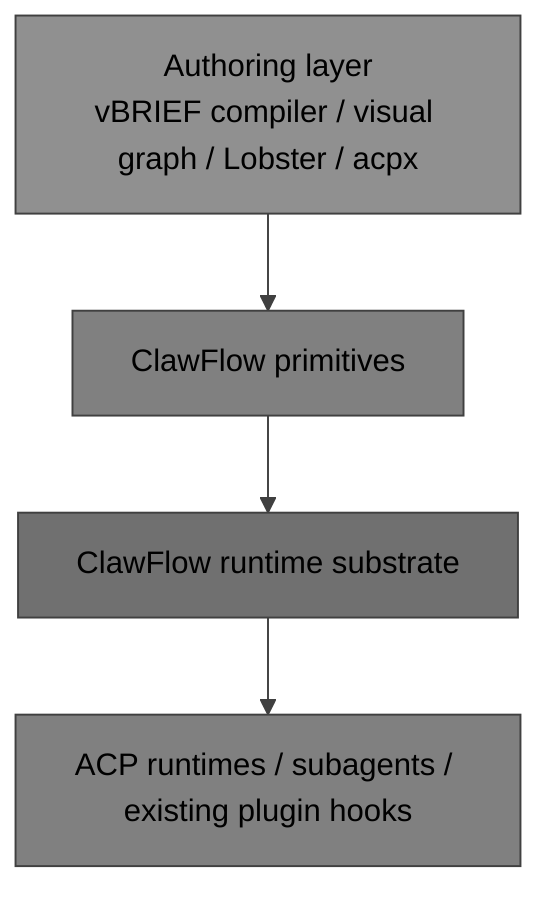

# ClawFlow Plan for vBRIEF Workflow Execution via Authoring Layers

## Problem statement
The key architectural point is that ClawFlow is intentionally not the graph orchestration layer. It is the runtime substrate underneath that layer.

That changes the integration plan. The goal is not to make ClawFlow itself into the full vBRIEF workflow engine. The goal is to build authoring and compiler layers above ClawFlow that understand DAGs, branching, expressions, and visual workflow semantics, then lower those semantics into ClawFlow primitives.

## Current state
The current ClawFlow substrate appears to provide flow creation, task execution within a flow, explicit waiting and output helpers, runtime updates, and terminal transitions including finish and fail. It also persists waiting state, task linkage, and outputs. That makes it a strong durable execution substrate for higher-level workflow tooling.

The existing ACP runtime, spawn, and subagent/plugin system is already the relevant extension surface. A graph authoring tool can use those same hooks rather than requiring a new ClawFlow-specific plugin API.

## Capability matrix

### Already aligned with this model
- Flow lifecycle primitives exist. `createFlow`, `resumeFlow`, `finishFlow`, and `failFlow` are the right durable runtime control points.
- Explicit waiting exists. Persisted waiting is a strong match for higher-level blocked states, approvals, and external callbacks.
- Output persistence exists. Higher layers can map workflow outputs onto this persisted runtime data.
- Task linkage exists. Higher-level workflow steps can compile down to linked task execution.
- Runtime update emission exists. Higher layers can project their own node- and graph-level views from that runtime activity.
- Existing ACP/subagent integration exists. That is the plugin/runtime surface a graph authoring layer should use.

### Useful substrate extensions
- Typed wait reasons rather than a narrowly task-centric wait model
- More structured output envelopes for authored workflows
- Better runtime metadata projection for higher-level graph observability
- Better child-flow / nested-flow linkage if sub-workflows need it
- Better exportable run metadata for debugging and round-trip tooling

### Capabilities that should live above ClawFlow
- Flow definition parsing and compilation
- Node and edge graph models
- Topological scheduling and ready-set calculation
- Branch activation, merge semantics, and fan-out / fan-in policies
- Port validation and routing
- Expression evaluation
- Visual workflow editing
- Workflow import/export and round-trip preservation

## Proposed architectural direction
ClawFlow should remain the durable runtime engine and execution store. vBRIEF should remain the portable definition and interchange layer. The missing piece is an authoring/compiler layer between them.

The long-term structure should be:
- a vBRIEF workflow definition
- an authoring/compiler layer that understands graph semantics
- emitted ClawFlow runtime calls
- persisted ClawFlow runtime state

This preserves the intended ClawFlow boundary while still allowing full workflow tooling above it.

## Phase 1: Sequential and branching-compatible compiler
### Goal
Make ClawFlow a reliable runtime target for a constrained vBRIEF subset through a compiler/adapter layer: sequential workflows, simple branching, `blocks` edges first, `data` edges second, literal parameters first, and basic failure semantics.

### Additions
- Add a compiler/adapter that reads a constrained vBRIEF workflow and emits ClawFlow calls
- Track workflow node state in the authoring layer, not as a native ClawFlow graph model
- Structure authored outputs predictably on top of the existing runtime outputs
- Generalize waiting where needed so higher layers can express approvals, external callbacks, and upstream dependencies
- Add compile-time validation for node references, DAG validity, and basic defaults
- Add a literal-only import mode for parameters and reject or warn on expressions during this phase

### Deliverable
A vBRIEF-driven authoring layer can execute linear and simply branched workflows on top of ClawFlow while keeping ClawFlow itself as the substrate.

## Phase 2: Full DAG authoring layer over ClawFlow
### Goal
Move from a constrained compiler to a graph-aware authoring layer that schedules and orchestrates DAG workflows above ClawFlow.

### Additions
- Add a topological scheduler in the authoring layer
- Support multiple incoming and outgoing edges and active branch tracking there
- Add a node type registry with default ports, parameter schemas, categories, and executor bindings
- Validate `fromPort` and `toPort` references during compile time
- Add merge strategies, fan-out/fan-in behavior, and branch activation rules
- Add edge conditions and routed outputs for branch nodes such as IF and Switch
- Project higher-level node status and graph state into runtime metadata and observability surfaces as needed

### Deliverable
The authoring layer provides full core DAG semantics while ClawFlow remains the durable execution runtime underneath.

## Phase 3: Expression, sub-workflow, and portable toolchain
### Goal
Reach strong compatibility with the richer parts of the Workflow Profile while preserving the authoring/runtime separation.

### Additions
- Add a restricted expression evaluator in the authoring layer for `{{ }}` syntax and standard workflow variables
- Add sub-workflow compilation and child-flow coordination
- Preserve and round-trip non-execution metadata such as `workflow.canvas`, annotations, and implementation-specific metadata
- Add export support for vBRIEF documents plus optional runtime metadata
- Add visual authoring and other higher-level tooling that targets the same compiler/runtime boundary
- Continue reusing the existing ACP runtime and subagent/plugin hooks instead of introducing a separate ClawFlow plugin API

### Deliverable
OpenClaw gains a portable workflow toolchain over ClawFlow rather than collapsing workflow authoring into ClawFlow itself.

## Recommended implementation order
The highest-leverage order is:
- compiler/adapter for a constrained vBRIEF subset
- better structured outputs and typed waits where needed
- compile-time validation
- DAG scheduler in the authoring layer
- port model and merge semantics
- restricted expressions
- sub-workflows
- round-trip export and visual authoring

This sequence keeps the runtime boundary clean while delivering useful value early.

## Risk notes
- The largest risk is pushing orchestration responsibilities down into ClawFlow and blurring its intended boundary.
- A second major risk is inventing a separate plugin API at the ClawFlow layer when the existing ACP/subagent integration already fills that role.
- Expression support should remain intentionally narrower than arbitrary JavaScript even if the surface syntax stays compatible with the Workflow Profile.
- Runtime persistence and authoring metadata should stay distinct to avoid coupling recovery concerns to authoring concerns.
