# vBRIEF Workflow Profile Extension

**Status**: Draft  
**Date**: 2026-03-30  
**Author**: Jonathan Taylor  
**Extends**: [vBRIEF Specification v0.5](../vbrief-spec-0.5.md)

## Abstract

This document defines the **Workflow Profile**, an extension to vBRIEF v0.5 that adds flow-based programming primitives to the Plan model. A vBRIEF Plan enriched with the Workflow Profile becomes an executable dataflow graph, compatible with visual workflow engines such as n8n, Node-RED, and similar tools.

The Workflow Profile is **strictly additive** and **fully backward-compatible**. Documents that omit the new fields remain valid vBRIEF v0.5 Plans.

## Status of This Document

This document specifies a draft extension of vBRIEF v0.5. It is intended for early implementers building workflow runtime integrations. Comments and issues should be filed at <https://github.com/visionik/vBRIEF/issues>.

## Table of Contents

1. [Introduction](#1-introduction)
2. [Relationship to Core Specification](#2-relationship-to-core-specification)
3. [Workflow Object](#3-workflow-object)
4. [PlanItem Extensions — Nodes](#4-planitem-extensions--nodes)
5. [Edge Extensions — Connections](#5-edge-extensions--connections)
6. [Canvas Object](#6-canvas-object)
7. [Execution Semantics](#7-execution-semantics)
8. [Expression Language](#8-expression-language)
9. [Error Handling](#9-error-handling)
10. [Sub-Workflows](#10-sub-workflows)
11. [Node Type Conventions](#11-node-type-conventions)
12. [TRON Encoding](#12-tron-encoding)
13. [Conformance](#13-conformance)
14. [Security Considerations](#14-security-considerations)
15. [Appendix A: Complete Examples](#appendix-a-complete-examples)
16. [Appendix B: Node Type Registry](#appendix-b-node-type-registry)
17. [Appendix C: Comparison with Existing Tools](#appendix-c-comparison-with-existing-tools)
18. [References](#references)

---

## 1. Introduction

### 1.1 Purpose

The vBRIEF Workflow Profile bridges the gap between structured planning (what vBRIEF v0.5 already provides) and executable dataflow programming. By adding a small number of optional fields to existing Plan and PlanItem objects, any vBRIEF Plan can graduate from a static dependency graph into a runnable workflow — without breaking compatibility with tools that understand only the core spec.

### 1.2 Terminology

The key words "MUST", "MUST NOT", "REQUIRED", "SHALL", "SHALL NOT", "SHOULD", "SHOULD NOT", "RECOMMENDED", "MAY", and "OPTIONAL" in this document are to be interpreted as described in [RFC 2119][rfc2119].

Additional terms specific to this extension:

- **Node** — A PlanItem that contains a `nodeType` field; the executable unit within a workflow.
- **Port** — A named input or output endpoint on a Node through which data flows.
- **Connection** — An Edge with `fromPort`/`toPort` fields; a typed link between node ports.
- **Workflow Runtime** — An implementation that interprets and executes Workflow Profile documents.

### 1.3 Design Goals

1. **Zero-overhead adoption** — Existing vBRIEF tools that ignore unknown fields continue to work unchanged.
2. **Visual-editor friendly** — Canvas metadata enables round-trip editing in visual workflow builders.
3. **Runtime-agnostic** — The profile describes *what* runs, not *how* a specific engine runs it.
4. **Graduated complexity** — A minimal workflow requires only `nodeType` on items and `data` edges. Advanced features (ports, expressions, error routing) are strictly additive.

### 1.4 Conceptual Model

The relationship between core vBRIEF and the Workflow Profile:

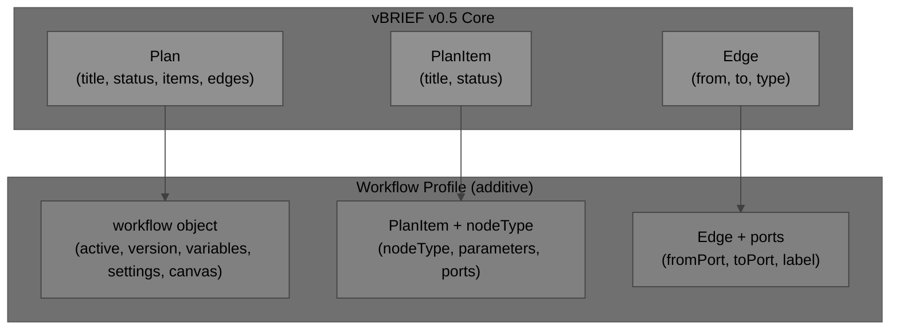

---

## 2. Relationship to Core Specification

### 2.1 Backward Compatibility

Every valid Workflow Profile document is also a valid vBRIEF v0.5 document. The extension adds OPTIONAL fields only; it defines no new REQUIRED fields on any existing object.

A core-only implementation that encounters Workflow Profile fields MUST preserve them (per vBRIEF v0.5 conformance rule 8: "Unknown fields at any level are preserved").

### 2.2 How Core Concepts Map to Workflow Concepts

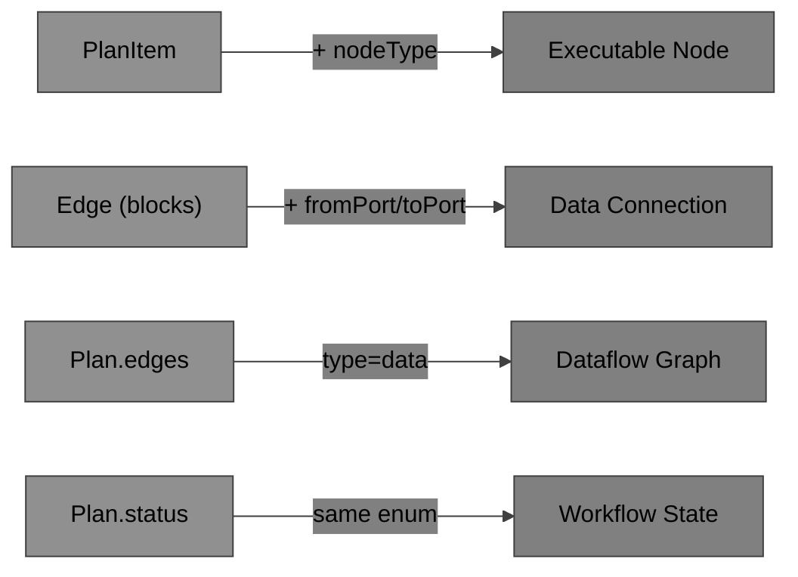

| Core Concept | Workflow Equivalent | Relationship |
|---|---|---|
| `PlanItem` | Node | PlanItem with `nodeType` becomes a node |
| `Edge` with `type: "blocks"` | Control flow connection | Hard dependency semantics preserved |
| `Edge` with `type: "data"` | Data flow connection | New edge type for dataflow |
| `plan.status` | Workflow execution state | Same enum values; `running` means executing |
| `PlanItem.status` | Node execution state | Same enum; `completed` = node finished |

### 2.3 Edge Type Coexistence

The Workflow Profile introduces the `data` edge type. This coexists with existing core edge types. A single workflow MAY use both `blocks` edges (hard dependencies without data) and `data` edges (data-carrying connections).

---

## 3. Workflow Object

### 3.1 Overview

The `workflow` field is an OPTIONAL object on the Plan. It contains runtime configuration, shared variables, execution settings, and canvas layout metadata.

```json
"workflow": {
  "active": true,
  "version": 4,
  "variables": { "maxRetries": 3, "apiBaseUrl": "https://api.example.com" },
  "settings": {
    "executionMode": "sequential",
    "continueOnFail": false,
    "timezone": "America/Los_Angeles",
    "errorWorkflow": "wf:error-handler-v2"
  },
  "canvas": { ... }
}
```

### 3.2 Fields

| Field | Type | Default | Description |
|---|---|---|---|
| `active` | boolean | `false` | Whether the workflow is enabled for execution. Inactive workflows MUST NOT be auto-triggered. |
| `version` | integer | — | Workflow revision number. Implementations SHOULD increment on each save. |
| `variables` | object | `{}` | Key-value store accessible to all nodes via expressions (see [Section 8](#8-expression-language)). Values MUST be JSON primitives or objects. |
| `settings` | object | `{}` | Execution configuration (see [Section 3.3](#33-execution-settings)). |
| `canvas` | object | — | Visual layout information (see [Section 6](#6-canvas-object)). |

### 3.3 Execution Settings

The `settings` object controls runtime behavior:

| Setting | Type | Default | Description |
|---|---|---|---|
| `executionMode` | string | `"sequential"` | `"sequential"` or `"parallel"`. Determines default execution order for independent nodes. |
| `continueOnFail` | boolean | `false` | If `true`, workflow continues executing downstream nodes when a node fails. |
| `timezone` | string | `"UTC"` | IANA timezone for cron triggers and date expressions. |
| `errorWorkflow` | string | — | ID or planRef of a workflow to invoke when this workflow fails. |
| `maxExecutionTime` | integer | — | Maximum execution time in seconds. Implementations SHOULD terminate workflows that exceed this limit. |
| `retryOnFail` | boolean | `false` | Whether failed nodes should be retried. |
| `maxRetries` | integer | `0` | Maximum number of retry attempts per node when `retryOnFail` is `true`. |
| `retryInterval` | integer | `0` | Milliseconds between retry attempts. |

### 3.4 Workflow Lifecycle

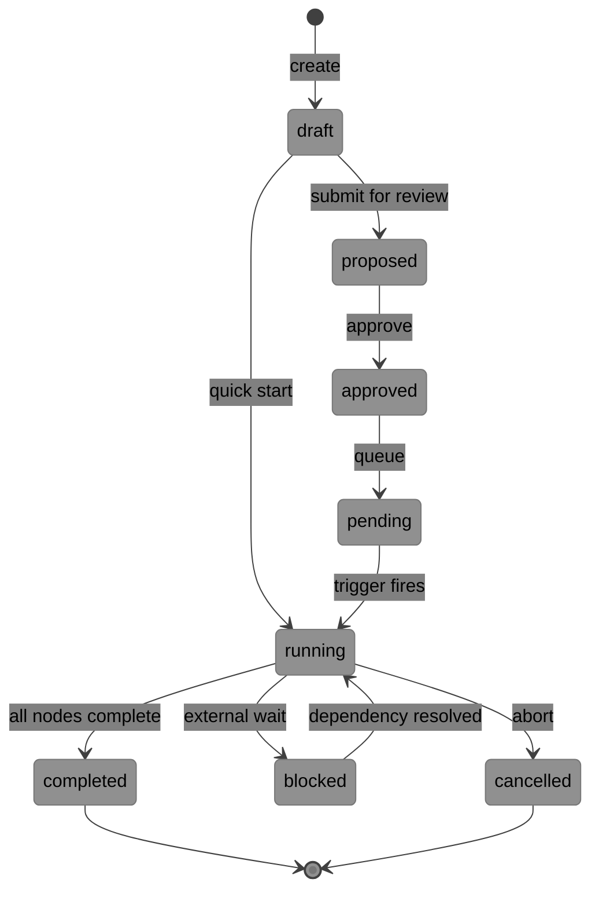

The lifecycle is identical to core vBRIEF Plan status. Workflow runtimes SHOULD interpret:

- **`draft`** — Workflow being designed; not executable.
- **`approved`** / **`pending`** — Workflow ready to run; waiting for trigger.
- **`running`** — Workflow currently executing.
- **`completed`** — All nodes finished successfully (or skipped per branching logic).
- **`blocked`** — Workflow paused on external dependency.
- **`cancelled`** — Workflow aborted; no further nodes will execute.

---

## 4. PlanItem Extensions — Nodes

### 4.1 Overview

A PlanItem becomes an **executable node** when it contains a `nodeType` field. PlanItems without `nodeType` are treated as standard planning items even within a workflow document.

### 4.2 Added Fields

| Field | Type | Requirement | Description |
|---|---|---|---|
| `nodeType` | string | OPTIONAL | Identifies the executable component. Format: `namespace:name` (see [Section 11](#11-node-type-conventions)). |
| `parameters` | object | OPTIONAL | Configuration values, static data, and expressions for the node. |
| `ports` | object | OPTIONAL | Declares available input and output ports (see [Section 4.3](#43-ports)). |
| `credentials` | string | OPTIONAL | Reference to a credential set (by name or ID). MUST NOT contain secrets inline. |
| `retryOnFail` | boolean | OPTIONAL | Per-node retry override. Takes precedence over `workflow.settings.retryOnFail`. |
| `maxRetries` | integer | OPTIONAL | Per-node max retries override. |
| `continueOnFail` | boolean | OPTIONAL | Per-node continue-on-fail override. |
| `disabled` | boolean | OPTIONAL | If `true`, the node is skipped during execution. Data passes through unchanged. |

### 4.3 Ports

The `ports` object declares what inputs a node accepts and what outputs it produces:

```json
"ports": {
  "in": ["main"],
  "out": [
    { "name": "main", "type": "object" },
    { "name": "error", "type": "object" }
  ]
}
```

#### Input Ports

`ports.in` is an array of strings — the names of input ports. If omitted and `nodeType` is present, the implementation MAY fall back to a node-type registry for defaults.

#### Output Ports

`ports.out` is an array of output port descriptor objects:

| Field | Type | Requirement | Description |
|---|---|---|---|
| `name` | string | REQUIRED | Port name. MUST be unique within the node's output ports. |
| `type` | string | OPTIONAL | Data type hint. Default: `"any"`. |
| `description` | string | OPTIONAL | Human-readable description of what this port emits. |

#### Allowed Port Types

| Type | Description |
|---|---|
| `any` | No type constraint (default). |
| `object` | JSON object. |
| `array` | JSON array. |
| `string` | String value. |
| `number` | Numeric value. |
| `boolean` | Boolean value. |
| `binary` | Binary data (e.g., file contents). |

#### Default Ports

If `ports` is absent and `nodeType` is present:

1. The implementation SHOULD consult a node-type registry for default port definitions.
2. If no registry entry exists, the implementation SHOULD assume one input port (`"main"`) and one output port (`{ "name": "main", "type": "any" }`).

### 4.4 Node Categories

Nodes are classified by their behavior in the dataflow graph:

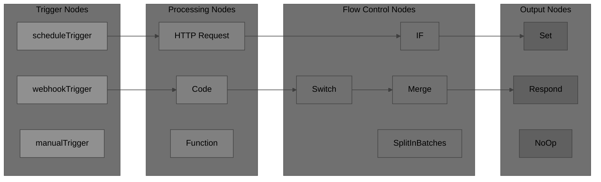

| Category | Description | Port Pattern |
|---|---|---|
| **Trigger** | Starts workflow execution. Has no input ports. | `in: [], out: [main]` |
| **Processing** | Transforms, fetches, or computes data. | `in: [main], out: [main, error?]` |
| **Flow Control** | Routes, splits, merges, or conditionally branches data. | `in: [main], out: [true, false, ...]` |
| **Output** | Terminal node; produces results or side effects. | `in: [main], out: []` or `out: [main]` |

### 4.5 Node State During Execution

When a workflow is running, each node's `status` field reflects its execution state:

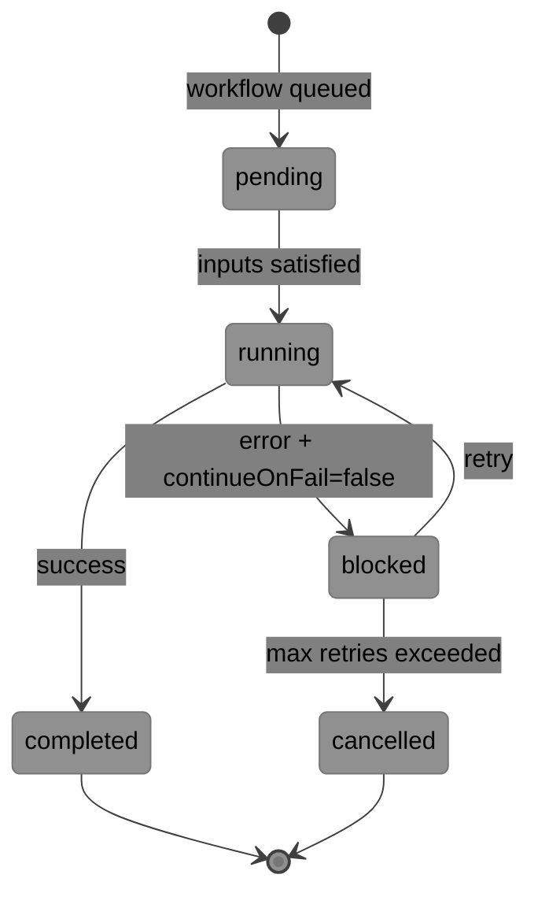

Runtimes MUST update `PlanItem.status` to reflect the current execution state of each node.

---

## 5. Edge Extensions — Connections

### 5.1 Overview

Edges in the Workflow Profile carry additional port-routing information to describe which output port of the source node connects to which input port of the target node.

### 5.2 Added Fields

| Field | Type | Default | Description |
|---|---|---|---|
| `fromPort` | string | `"main"` | Output port name on the source node. |
| `toPort` | string | `"main"` | Input port name on the target node. |
| `label` | string | — | OPTIONAL human-readable label displayed on the connection in visual editors. |
| `condition` | string | — | OPTIONAL expression that must evaluate to `true` for data to flow through this edge. |

### 5.3 Edge Types for Workflows

The Workflow Profile adds one new edge type and redefines the semantics of existing types in a workflow context:

| Type | Workflow Semantics |
|---|---|
| `data` | **Primary dataflow.** Data produced by the source node's output port is passed to the target node's input port. This is the RECOMMENDED edge type for workflow connections. |
| `blocks` | **Hard dependency without data transfer.** The target node MUST NOT start until the source completes, but no data is passed. Retains core vBRIEF semantics. |
| `informs` | **Soft context.** The target MAY read context from the source's output but is not blocked by it. |
| `invalidates` | **Cancellation signal.** If the source completes, the target SHOULD be skipped or cancelled. |
| `suggests` | **Advisory.** No execution dependency. Preserved for human-facing planning context. |

### 5.4 Dataflow Visualization

A typical workflow with branching and error handling:

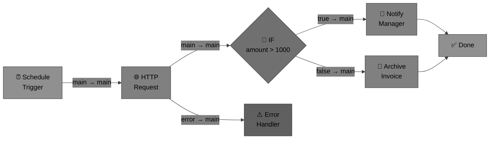

### 5.5 Graph Constraints

All constraints from [vBRIEF v0.5 Section 6.4](../vbrief-spec-0.5.md#64-graph-constraints) apply:

1. Edges MUST form a valid DAG. Cycles are prohibited.
2. `from` and `to` MUST reference existing item IDs.
3. `fromPort` MUST reference a declared output port on the source node (or `"main"` if ports are unspecified).
4. `toPort` MUST reference a declared input port on the target node (or `"main"` if ports are unspecified).
5. Implementations MUST validate port references when `ports` are declared on the referenced nodes.

---

## 6. Canvas Object

### 6.1 Overview

The `canvas` object stores visual layout information for workflow editors. It is purely presentational and has no effect on execution semantics.

### 6.2 Placement

The canvas object SHOULD be placed at `workflow.canvas`. A top-level `canvas` field on the Plan is permitted for backward compatibility but is **DEPRECATED**.

### 6.3 Structure

```json
"canvas": {
  "nodes": {
    "trigger1": { "x": 200, "y": 180, "width": 160, "height": 80 },
    "http1":    { "x": 480, "y": 180 },
    "if1":      { "x": 760, "y": 180 }
  },
  "viewport": {
    "x": 0,
    "y": 0,
    "zoom": 1.0
  },
  "annotations": [
    {
      "id": "note1",
      "type": "text",
      "content": "Main processing path",
      "x": 480,
      "y": 100
    }
  ]
}
```

### 6.4 Fields

#### Node Position

Each key in `canvas.nodes` MUST be the `id` of an item in the plan. The value is a position object:

| Field | Type | Requirement | Description |
|---|---|---|---|
| `x` | number | REQUIRED | Horizontal position in canvas coordinates. |
| `y` | number | REQUIRED | Vertical position in canvas coordinates. |
| `width` | number | OPTIONAL | Custom node width. Implementations MAY use defaults. |
| `height` | number | OPTIONAL | Custom node height. Implementations MAY use defaults. |

#### Viewport

| Field | Type | Default | Description |
|---|---|---|---|
| `x` | number | `0` | Horizontal scroll offset. |
| `y` | number | `0` | Vertical scroll offset. |
| `zoom` | number | `1.0` | Zoom level. MUST be > 0. |

#### Annotations

The `annotations` array is OPTIONAL and MAY contain visual annotations (sticky notes, labels, group boxes):

| Field | Type | Requirement | Description |
|---|---|---|---|
| `id` | string | REQUIRED | Unique annotation identifier. |
| `type` | string | REQUIRED | Annotation type: `"text"`, `"group"`, `"frame"`. |
| `content` | string | OPTIONAL | Display text. |
| `x` | number | REQUIRED | Horizontal position. |
| `y` | number | REQUIRED | Vertical position. |
| `width` | number | OPTIONAL | Width (for groups/frames). |
| `height` | number | OPTIONAL | Height (for groups/frames). |

---

## 7. Execution Semantics

### 7.1 Execution Order

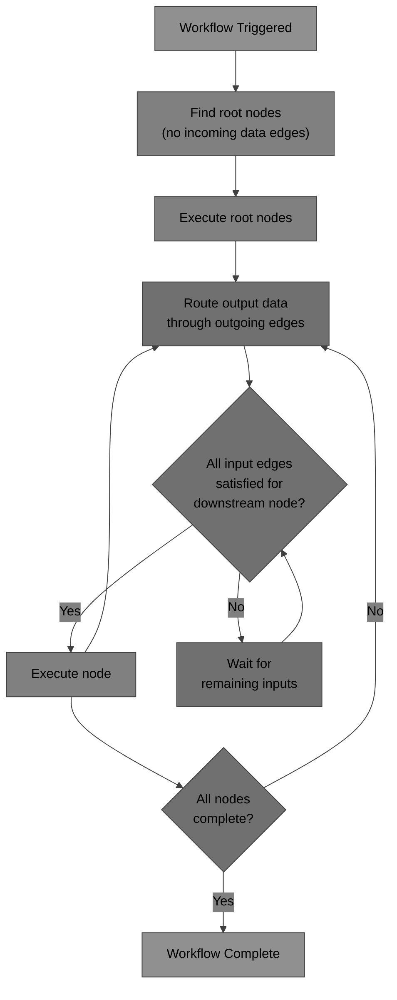

Workflow runtimes MUST follow this execution model:

1. **Root discovery** — Find all nodes with no incoming `data` or `blocks` edges. These are trigger or entry nodes.
2. **Topological execution** — Execute nodes in topological order of the DAG. A node becomes eligible for execution when all its upstream `data` and `blocks` edges have been satisfied.
3. **Data propagation** — When a node completes, its output data is routed through all outgoing `data` edges to the specified `toPort` on each target node.
4. **Parallel vs. sequential** — When `executionMode` is `"parallel"`, independent nodes (no mutual edges) MAY execute concurrently. When `"sequential"`, nodes execute one at a time in topological order.

### 7.2 Data Passing Model

Data flows through edges as JSON values. Each node receives an input object assembled from all incoming `data` edges:

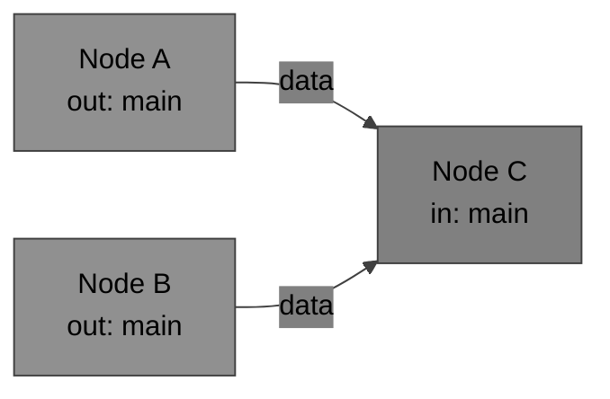

When multiple `data` edges target the same input port, the runtime MUST merge the incoming data. The RECOMMENDED merge strategy is array concatenation — each incoming data item is appended to the input array.

### 7.3 Branching

Flow control nodes (IF, Switch) route data to different output ports based on conditions:

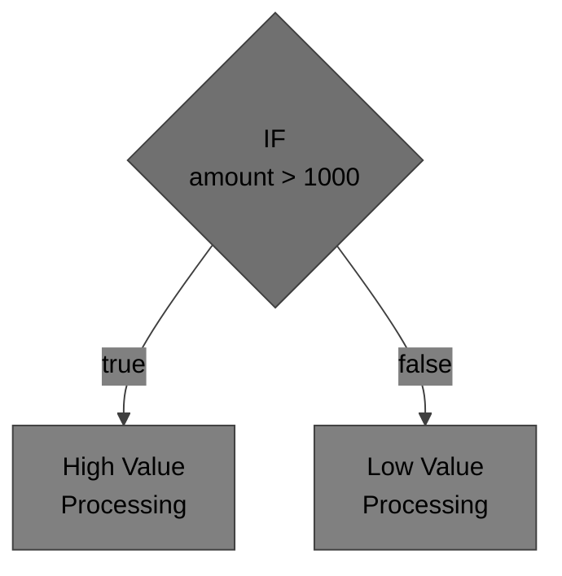

Nodes downstream of an unactivated branch MUST NOT execute. If all paths through the graph reconverge at a merge node, the merge node SHOULD wait for whichever branch was activated.

### 7.4 Disabled Nodes

When `disabled: true` is set on a node:

1. The node MUST NOT execute.
2. Data arriving at the node's input ports SHOULD be passed through to any downstream nodes connected to the node's `"main"` output port.
3. The node's status SHOULD remain `"pending"`.

---

## 8. Expression Language

### 8.1 Syntax

Expressions in `parameters` values allow nodes to reference upstream data, workflow variables, and environment context. Expressions are delimited by `{{ }}`:

```json
"parameters": {
  "url": "{{ $vars.apiBaseUrl }}/invoices/{{ $json.invoiceId }}",
  "method": "GET",
  "headers": {
    "Authorization": "Bearer {{ $vars.apiToken }}"
  }
}
```

### 8.2 Expression Context Variables

| Variable | Description |
|---|---|
| `$json` | Output data from the immediately preceding node (the first item if array). |
| `$input` | Complete input data for the current node (all items). |
| `$vars` | Workflow-level variables from `workflow.variables`. |
| `$env` | Environment variables (access controlled by runtime). |
| `$node` | Metadata about the current node (id, name, parameters). |
| `$workflow` | Workflow metadata (id, name, active). |
| `$execution` | Current execution metadata (id, timestamp, mode). |
| `$now` | Current ISO 8601 timestamp. |
| `$today` | Current date string (YYYY-MM-DD). |

### 8.3 Expression Evaluation Rules

1. Expressions MUST be evaluated at execution time, not at parse time.
2. If an expression references a variable that does not exist, the runtime SHOULD raise an error (not silently produce `null`).
3. Expressions MUST NOT have side effects. They are pure data accessors.
4. Implementations MAY support JavaScript-like expressions within `{{ }}` delimiters for complex transformations (e.g., `{{ $json.items.filter(i => i.active) }}`).
5. String values that do not contain `{{ }}` delimiters MUST be treated as literal strings.

### 8.4 Security

Expressions MUST NOT be used to execute arbitrary code unless the runtime explicitly enables a sandboxed code execution mode. See [Section 14](#14-security-considerations) for details.

---

## 9. Error Handling

### 9.1 Error Routing

Nodes MAY declare an `"error"` output port. When a node fails:

1. If the node has an `"error"` output port with a connected downstream node, the error data MUST be routed to that port.
2. If `continueOnFail` is `true` (at node or workflow level), downstream nodes on the `"main"` output port receive the last successful input data.
3. If `continueOnFail` is `false` and no error port is connected, the workflow MUST halt and set its status to `"blocked"`.

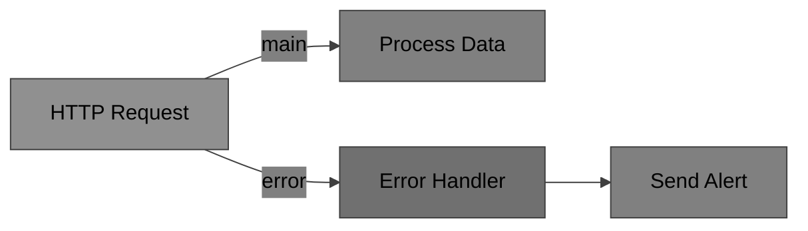

### 9.2 Error Data Shape

When a node fails, the data emitted on the `"error"` output port SHOULD conform to:

```json
{
  "error": {
    "message": "Connection refused",
    "code": "ECONNREFUSED",
    "node": "http1",
    "timestamp": "2026-03-30T10:15:30Z",
    "input": { ... }
  }
}
```

### 9.3 Retry Behavior

When `retryOnFail` is `true`:

1. The runtime MUST retry the failed node up to `maxRetries` times.
2. Between retries, the runtime SHOULD wait `retryInterval` milliseconds.
3. If all retries are exhausted, the node is treated as failed (error routing applies).
4. During retries, the node's `status` SHOULD remain `"running"`.

### 9.4 Error Workflow

When `workflow.settings.errorWorkflow` is set and the workflow fails:

1. The runtime SHOULD invoke the referenced error workflow.
2. The error workflow receives the failed workflow's execution context as input.
3. Circular error workflow references MUST be detected and rejected at validation time.

---

## 10. Sub-Workflows

### 10.1 Invoking Sub-Workflows

A node with `nodeType: "core:executeWorkflow"` invokes another vBRIEF workflow:

```json
{
  "id": "sub1",
  "title": "Process Batch",
  "status": "pending",
  "nodeType": "core:executeWorkflow",
  "parameters": {
    "workflowRef": "file://./batch-processor.vbrief.json",
    "inputData": "{{ $json }}"
  }
}
```

This leverages the existing `planRef` pattern from vBRIEF v0.5.

### 10.2 Sub-Workflow Data Flow

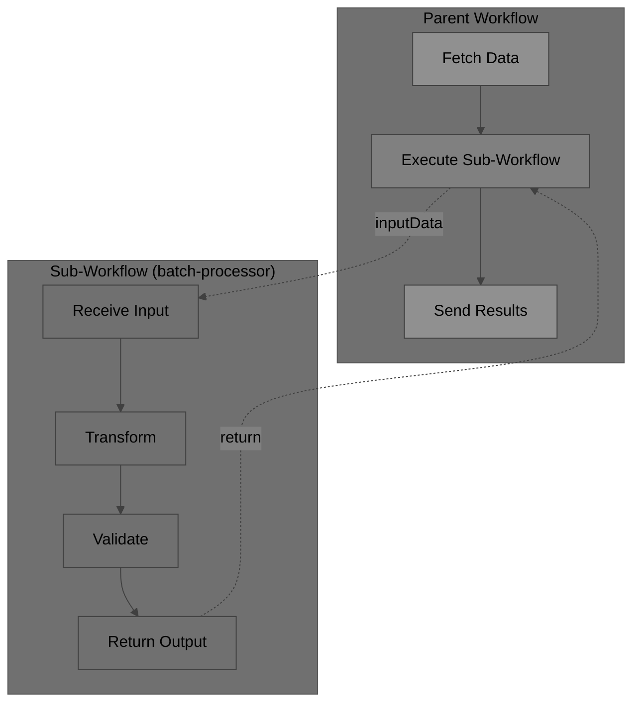

### 10.3 Sub-Workflow Execution

1. The sub-workflow executes as an independent workflow instance.
2. The parent node waits for the sub-workflow to complete before emitting output.
3. The sub-workflow's final output (from its terminal nodes) becomes the parent node's output.
4. Sub-workflow errors propagate to the parent node's error port.

---

## 11. Node Type Conventions

### 11.1 Naming Format

Node type identifiers use the format `namespace:name`:

```
core:HTTP Request
core:IF
core:Switch
core:Code
core:scheduleTrigger
google:drive
slack:sendMessage
custom:myProcessor
```

### 11.2 Reserved Namespaces

| Namespace | Description |
|---|---|
| `core` | Built-in nodes provided by any conformant runtime. |
| `code` | User-defined code execution nodes (e.g., `code:JavaScript`, `code:Python`). |

All other namespaces are available for vendor or community node packages.

### 11.3 Core Node Types

Conformant Workflow Profile implementations SHOULD support at minimum:

| Node Type | Category | Description |
|---|---|---|
| `core:manualTrigger` | Trigger | Starts workflow on manual invocation. |
| `core:scheduleTrigger` | Trigger | Starts workflow on a cron schedule. |
| `core:webhookTrigger` | Trigger | Starts workflow on incoming HTTP request. |
| `core:HTTP Request` | Processing | Makes HTTP requests. |
| `core:Set` | Processing | Sets or transforms data fields. |
| `core:IF` | Flow Control | Conditional branching (true/false). |
| `core:Switch` | Flow Control | Multi-way branching. |
| `core:Merge` | Flow Control | Combines data from multiple branches. |
| `core:SplitInBatches` | Flow Control | Splits array data into batches for iteration. |
| `core:NoOp` | Output | No operation; passes data through. Useful for visual organization. |
| `core:executeWorkflow` | Processing | Invokes a sub-workflow. |
| `code:JavaScript` | Processing | Executes user-defined JavaScript. |
| `code:Python` | Processing | Executes user-defined Python. |

### 11.4 Trigger Node Patterns

Trigger nodes have no input ports and produce the initial data for the workflow:

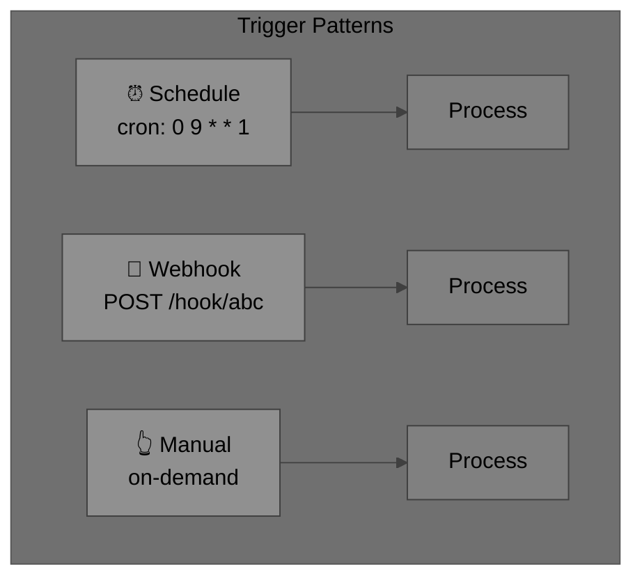

---

## 12. TRON Encoding

### 12.1 Extended Class Definitions

Workflow Profile documents in TRON add class definitions for the new structures:

```tron
class Edge: from, to, type, fromPort, toPort
class PlanItem: id, title, status, nodeType, parameters, ports
class Port: name, type
class Workflow: active, version, variables, settings, canvas
```

### 12.2 Example

```tron
class Edge: from, to, type, fromPort, toPort
class PlanItem: id, title, status, nodeType, parameters, ports
class Port: name, type

vBRIEFInfo: { version: "0.5" }
plan: {
  id: "wf:invoice-processing",
  title: "Invoice Processing",
  status: "running",
  workflow: {
    active: true,
    version: 2,
    variables: { maxRetries: 3 },
    settings: { executionMode: "sequential" }
  },
  items: [
    PlanItem(
      "trigger1", "Daily Trigger", "running",
      "core:scheduleTrigger",
      { cron: "0 9 * * 1" },
      { in: [], out: [Port("main", "object")] }
    ),
    PlanItem(
      "http1", "Fetch Invoices", "pending",
      "core:HTTP Request",
      { url: "https://api.example.com/invoices", method: "GET" },
      { in: ["main"], out: [Port("main", "object"), Port("error", "object")] }
    ),
    PlanItem(
      "if1", "High Value?", "pending",
      "core:IF",
      { condition: "{{ $json.amount > 1000 }}" },
      { in: ["main"], out: [Port("true", "object"), Port("false", "object")] }
    )
  ],
  edges: [
    Edge("trigger1", "http1", "data", "main", "main"),
    Edge("http1", "if1", "data", "main", "main")
  ]
}
```

### 12.3 Conformance

TRON encoding of Workflow Profile documents follows the same rules as [vBRIEF v0.5 Section 7.3](../vbrief-spec-0.5.md#73-conformance): round-trip conversion MUST preserve all data, and JSON remains the canonical serialization.

---

## 13. Conformance

### 13.1 Profile Detection

A vBRIEF v0.5 document uses the Workflow Profile if ANY of the following are true:

1. The Plan object contains a `workflow` field.
2. Any PlanItem contains a `nodeType` field.
3. Any Edge contains a `fromPort` or `toPort` field.
4. Any Edge has `type: "data"`.

### 13.2 Conformance Criteria

A document is Workflow Profile conformant if and only if:

1. It is a valid vBRIEF v0.5 document (satisfies all [core conformance criteria](../vbrief-spec-0.5.md#81-conformance-criteria)).
2. If `workflow` is present, it is an object with the fields defined in [Section 3](#3-workflow-object).
3. If `nodeType` is present on any PlanItem, it is a non-empty string.
4. If `ports` is present, `ports.in` is an array of strings and `ports.out` is an array of port descriptor objects.
5. If `fromPort` or `toPort` is present on an Edge, they are non-empty strings.
6. All `fromPort` values reference valid output ports on the source node.
7. All `toPort` values reference valid input ports on the target node.
8. No circular `errorWorkflow` references exist.
9. All edges still form a valid DAG.
10. Expressions in `parameters` use `{{ }}` delimiters.

### 13.3 Validation Levels

Implementations SHOULD support three validation levels:

| Level | Scope | When to Use |
|---|---|---|
| **Structural** | JSON structure, required fields, type checking. | Always. |
| **Semantic** | Port references, expression syntax, DAG validity. | Before execution. |
| **Runtime** | Credential availability, external service reachability, expression evaluation. | At execution time. |

---

## 14. Security Considerations

In addition to [vBRIEF v0.5 Section 9](../vbrief-spec-0.5.md#9-security-considerations):

1. **No inline secrets.** The `credentials` field MUST reference credentials by name or ID. Implementations MUST NOT store secrets directly in `parameters` or `variables`. Secrets SHOULD be resolved at execution time from a secure credential store.

2. **Expression sandboxing.** Expression evaluation (Section 8) MUST be sandboxed. Expressions MUST NOT have access to the filesystem, network, or process environment beyond explicitly provided context variables.

3. **Code node isolation.** Nodes with `nodeType` in the `code:` namespace execute user-supplied code. Runtimes MUST execute such code in an isolated environment (e.g., sandboxed VM, container, or restricted process). Code nodes MUST NOT have access to the workflow runtime's internal state.

4. **Webhook validation.** `core:webhookTrigger` nodes SHOULD support signature verification (HMAC, JWT) to prevent unauthorized invocations.

5. **Sub-workflow depth limits.** Implementations SHOULD enforce a maximum sub-workflow nesting depth (RECOMMENDED: 10) to prevent resource exhaustion from recursive workflows.

6. **Rate limiting.** Implementations SHOULD support rate limiting on trigger nodes to prevent runaway execution.

---

## Appendix A: Complete Examples

### A.1 Minimal Workflow

The simplest possible workflow — a manual trigger connected to an HTTP request:

```json
{
  "vBRIEFInfo": { "version": "0.5" },
  "plan": {
    "id": "wf:minimal",
    "title": "Minimal Workflow",
    "status": "draft",
    "workflow": {
      "active": false,
      "version": 1
    },
    "items": [
      {
        "id": "trigger",
        "title": "Manual Start",
        "status": "pending",
        "nodeType": "core:manualTrigger",
        "ports": {
          "in": [],
          "out": [{ "name": "main", "type": "any" }]
        }
      },
      {
        "id": "http",
        "title": "Fetch Data",
        "status": "pending",
        "nodeType": "core:HTTP Request",
        "parameters": {
          "url": "https://api.example.com/data",
          "method": "GET"
        }
      }
    ],
    "edges": [
      {
        "from": "trigger",
        "to": "http",
        "type": "data",
        "fromPort": "main",
        "toPort": "main"
      }
    ]
  }
}
```

Visualized:

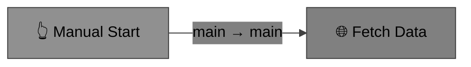

### A.2 Invoice Processing with Error Handling (Full Example)

```json
{
  "vBRIEFInfo": { "version": "0.5" },
  "plan": {
    "id": "wf:invoice-processing-v4",
    "title": "Invoice Processing with Error Handling",
    "status": "running",
    "timezone": "America/Los_Angeles",
    "narratives": {
      "Proposal": "Automate invoice fetching, classification, and routing based on value.",
      "Background": "Manual invoice processing takes 2 hours/day. High-value invoices require manager approval."
    },

    "workflow": {
      "active": true,
      "version": 4,
      "variables": {
        "maxRetries": 3,
        "highValueThreshold": 1000,
        "apiBaseUrl": "https://api.example.com"
      },
      "settings": {
        "executionMode": "sequential",
        "continueOnFail": false,
        "timezone": "America/Los_Angeles",
        "errorWorkflow": "wf:error-handler-v2",
        "retryOnFail": true,
        "maxRetries": 2,
        "retryInterval": 5000
      },
      "canvas": {
        "nodes": {
          "trigger1": { "x": 200, "y": 180 },
          "http1":    { "x": 480, "y": 180 },
          "if1":      { "x": 760, "y": 180 },
          "notify1":  { "x": 1040, "y": 80 },
          "archive1": { "x": 1040, "y": 280 },
          "error1":   { "x": 480, "y": 380 }
        },
        "viewport": { "x": 0, "y": 0, "zoom": 1.0 },
        "annotations": [
          {
            "id": "note-main",
            "type": "text",
            "content": "Main processing path",
            "x": 600,
            "y": 80
          }
        ]
      }
    },

    "items": [
      {
        "id": "trigger1",
        "title": "Weekly Schedule",
        "status": "running",
        "nodeType": "core:scheduleTrigger",
        "parameters": {
          "cron": "0 9 * * 1"
        },
        "ports": {
          "in": [],
          "out": [{ "name": "main", "type": "object" }]
        }
      },
      {
        "id": "http1",
        "title": "Fetch Invoice Data",
        "status": "pending",
        "nodeType": "core:HTTP Request",
        "parameters": {
          "url": "{{ $vars.apiBaseUrl }}/invoices?status=pending",
          "method": "GET",
          "headers": {
            "Accept": "application/json"
          }
        },
        "ports": {
          "in": ["main"],
          "out": [
            { "name": "main", "type": "object" },
            { "name": "error", "type": "object" }
          ]
        },
        "retryOnFail": true,
        "maxRetries": 3
      },
      {
        "id": "if1",
        "title": "High Value Invoice?",
        "status": "pending",
        "nodeType": "core:IF",
        "parameters": {
          "condition": "{{ $json.amount > $vars.highValueThreshold }}"
        },
        "ports": {
          "in": ["main"],
          "out": [
            { "name": "true", "type": "object", "description": "Invoices above threshold" },
            { "name": "false", "type": "object", "description": "Standard invoices" }
          ]
        }
      },
      {
        "id": "notify1",
        "title": "Notify Manager",
        "status": "pending",
        "nodeType": "core:HTTP Request",
        "parameters": {
          "url": "{{ $vars.apiBaseUrl }}/notifications",
          "method": "POST",
          "body": {
            "type": "high-value-invoice",
            "invoiceId": "{{ $json.id }}",
            "amount": "{{ $json.amount }}"
          }
        },
        "ports": {
          "in": ["main"],
          "out": [{ "name": "main", "type": "object" }]
        }
      },
      {
        "id": "archive1",
        "title": "Archive Invoice",
        "status": "pending",
        "nodeType": "core:HTTP Request",
        "parameters": {
          "url": "{{ $vars.apiBaseUrl }}/invoices/{{ $json.id }}/archive",
          "method": "POST"
        },
        "ports": {
          "in": ["main"],
          "out": [{ "name": "main", "type": "object" }]
        }
      },
      {
        "id": "error1",
        "title": "Handle Fetch Error",
        "status": "pending",
        "nodeType": "core:HTTP Request",
        "parameters": {
          "url": "{{ $vars.apiBaseUrl }}/alerts",
          "method": "POST",
          "body": {
            "type": "workflow-error",
            "workflow": "{{ $workflow.id }}",
            "error": "{{ $json.error.message }}"
          }
        },
        "ports": {
          "in": ["main"],
          "out": [{ "name": "main", "type": "object" }]
        }
      }
    ],

    "edges": [
      {
        "from": "trigger1",
        "to": "http1",
        "type": "data",
        "fromPort": "main",
        "toPort": "main"
      },
      {
        "from": "http1",
        "to": "if1",
        "type": "data",
        "fromPort": "main",
        "toPort": "main"
      },
      {
        "from": "http1",
        "to": "error1",
        "type": "data",
        "fromPort": "error",
        "toPort": "main",
        "label": "on error"
      },
      {
        "from": "if1",
        "to": "notify1",
        "type": "data",
        "fromPort": "true",
        "toPort": "main",
        "label": "high value"
      },
      {
        "from": "if1",
        "to": "archive1",
        "type": "data",
        "fromPort": "false",
        "toPort": "main",
        "label": "standard"
      }
    ]
  }
}
```

Visualized:

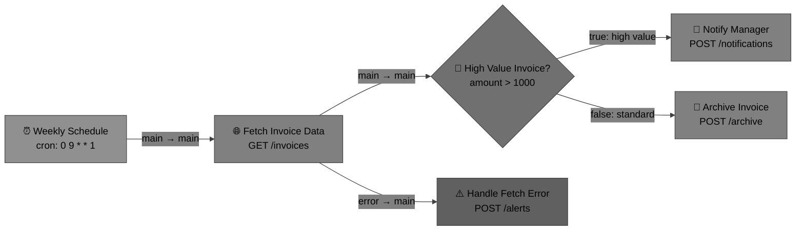

### A.3 Parallel Processing with Merge

```json
{
  "vBRIEFInfo": { "version": "0.5" },
  "plan": {
    "id": "wf:parallel-enrichment",
    "title": "Parallel Data Enrichment",
    "status": "draft",
    "workflow": {
      "active": false,
      "version": 1,
      "settings": { "executionMode": "parallel" }
    },
    "items": [
      {
        "id": "trigger",
        "title": "Webhook Trigger",
        "status": "pending",
        "nodeType": "core:webhookTrigger",
        "parameters": { "path": "/enrich", "method": "POST" },
        "ports": { "in": [], "out": [{ "name": "main", "type": "object" }] }
      },
      {
        "id": "geo-lookup",
        "title": "Geo Lookup",
        "status": "pending",
        "nodeType": "core:HTTP Request",
        "parameters": {
          "url": "https://geo.api.example.com/lookup?ip={{ $json.ip }}",
          "method": "GET"
        }
      },
      {
        "id": "company-lookup",
        "title": "Company Lookup",
        "status": "pending",
        "nodeType": "core:HTTP Request",
        "parameters": {
          "url": "https://company.api.example.com/lookup?domain={{ $json.domain }}",
          "method": "GET"
        }
      },
      {
        "id": "merge",
        "title": "Merge Results",
        "status": "pending",
        "nodeType": "core:Merge",
        "parameters": { "mode": "combine" },
        "ports": {
          "in": ["input1", "input2"],
          "out": [{ "name": "main", "type": "object" }]
        }
      },
      {
        "id": "respond",
        "title": "Return Enriched Data",
        "status": "pending",
        "nodeType": "core:Set",
        "parameters": {
          "values": {
            "enriched": true,
            "geo": "{{ $json.geo }}",
            "company": "{{ $json.company }}"
          }
        }
      }
    ],
    "edges": [
      { "from": "trigger", "to": "geo-lookup", "type": "data", "fromPort": "main", "toPort": "main" },
      { "from": "trigger", "to": "company-lookup", "type": "data", "fromPort": "main", "toPort": "main" },
      { "from": "geo-lookup", "to": "merge", "type": "data", "fromPort": "main", "toPort": "input1" },
      { "from": "company-lookup", "to": "merge", "type": "data", "fromPort": "main", "toPort": "input2" },
      { "from": "merge", "to": "respond", "type": "data", "fromPort": "main", "toPort": "main" }
    ]
  }
}
```

Visualized:

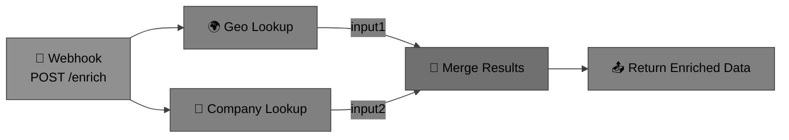

### A.4 Mixed Workflow and Planning Document

A key strength of the Workflow Profile is that workflow nodes and traditional planning items coexist in the same document:

```json
{
  "vBRIEFInfo": { "version": "0.5" },
  "plan": {
    "id": "release-v3",
    "title": "Release v3.0 with Automated Checks",
    "status": "running",
    "narratives": {
      "Proposal": "Automate the pre-release validation pipeline while keeping manual approval gates.",
      "Risk": "Automated tests may miss edge cases that manual QA would catch."
    },
    "workflow": {
      "active": true,
      "version": 1,
      "settings": { "executionMode": "sequential" }
    },
    "items": [
      {
        "id": "lint",
        "title": "Run Linters",
        "status": "completed",
        "nodeType": "core:executeWorkflow",
        "parameters": { "workflowRef": "file://./ci-lint.vbrief.json" }
      },
      {
        "id": "test",
        "title": "Run Test Suite",
        "status": "running",
        "nodeType": "core:executeWorkflow",
        "parameters": { "workflowRef": "file://./ci-test.vbrief.json" }
      },
      {
        "id": "review",
        "title": "Manual Code Review",
        "status": "pending",
        "narrative": { "Action": "Requires senior engineer sign-off before deploy." }
      },
      {
        "id": "deploy",
        "title": "Deploy to Production",
        "status": "pending",
        "nodeType": "core:HTTP Request",
        "parameters": {
          "url": "https://deploy.example.com/v3",
          "method": "POST"
        }
      }
    ],
    "edges": [
      { "from": "lint", "to": "test", "type": "data", "fromPort": "main", "toPort": "main" },
      { "from": "test", "to": "review", "type": "blocks" },
      { "from": "review", "to": "deploy", "type": "blocks" }
    ]
  }
}
```

Note how `review` is a traditional PlanItem (no `nodeType`) with a `blocks` edge — it represents a manual gate in an otherwise automated pipeline.

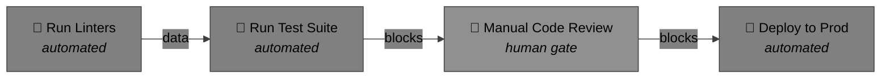

---

## Appendix B: Node Type Registry

### B.1 Registry Concept

A **node type registry** maps `nodeType` strings to default port definitions, parameter schemas, and documentation. Registries are implementation-specific and are NOT defined by this specification.

A registry entry SHOULD include:

```json
{
  "nodeType": "core:HTTP Request",
  "category": "processing",
  "description": "Makes HTTP requests to external services.",
  "defaultPorts": {
    "in": ["main"],
    "out": [
      { "name": "main", "type": "object" },
      { "name": "error", "type": "object" }
    ]
  },
  "parameterSchema": {
    "url": { "type": "string", "required": true },
    "method": { "type": "string", "enum": ["GET", "POST", "PUT", "PATCH", "DELETE"], "default": "GET" },
    "headers": { "type": "object" },
    "body": { "type": "any" },
    "authentication": { "type": "string", "enum": ["none", "basicAuth", "headerAuth", "oauth2"] }
  }
}
```

### B.2 Common Patterns

**IF Node** — Two output ports:

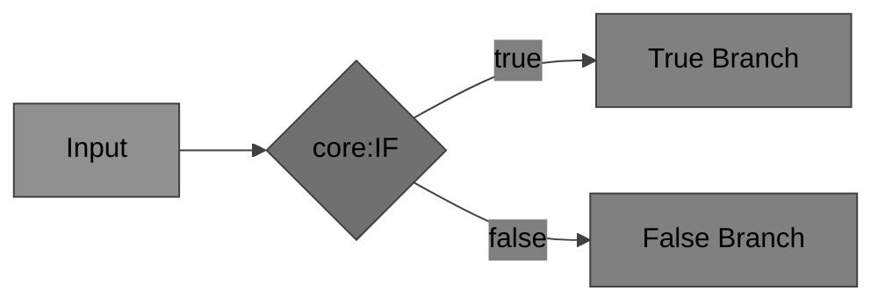

**Switch Node** — N output ports:

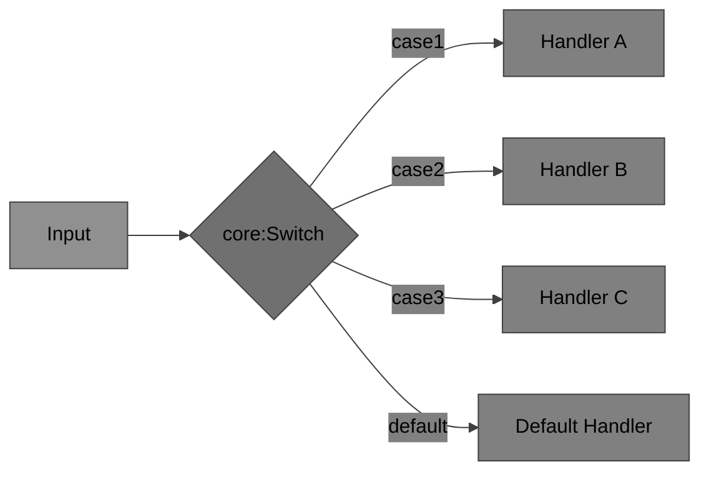

**Merge Node** — Multiple input ports:

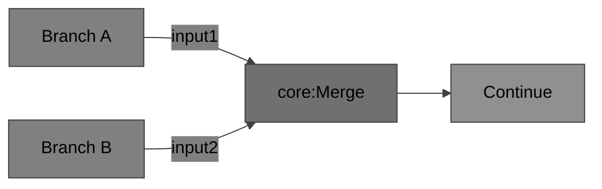

---

## Appendix C: Comparison with Existing Tools

### C.1 How the Workflow Profile Relates to Existing Flow-Based Tools

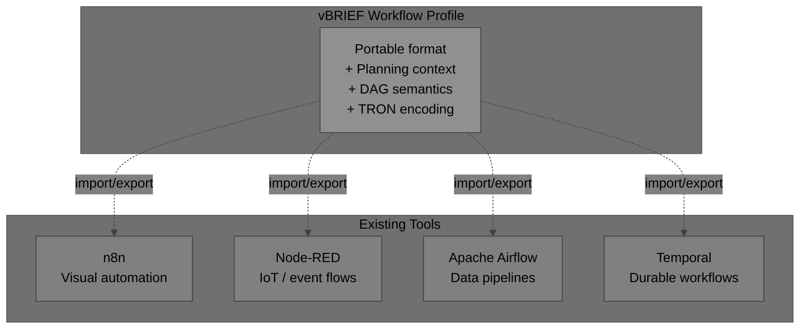

### C.2 Feature Comparison

| Feature | vBRIEF Workflow | n8n | Node-RED | Airflow |
|---|---|---|---|---|
| Format | JSON / TRON | JSON | JSON | Python DAG |
| Planning context (narratives) | Yes | No | No | No |
| Edge types (blocks, informs, data) | Yes | No (implicit) | No (implicit) | Yes (triggers) |
| Visual canvas metadata | Yes | Yes | Yes | No |
| Token-efficient encoding | Yes (TRON) | No | No | No |
| Mixed manual + automated nodes | Yes | No | No | Manual sensors only |
| Portable / runtime-agnostic | Yes | Vendor-specific | Vendor-specific | Vendor-specific |
| DAG validation | Built-in | Runtime only | No | Built-in |
| Expression language | `{{ }}` | `{{ }}` | Mustache | Jinja2 |

### C.3 Interoperability

The Workflow Profile is designed to be **importable from** and **exportable to** existing workflow tools:

- **n8n → vBRIEF**: Map n8n's `nodes[]` to `plan.items[]` with `nodeType`, map `connections` to `edges` with `fromPort`/`toPort`.
- **Node-RED → vBRIEF**: Map Node-RED's `flows[]` to `plan.items[]`, map `wires` to `edges`.
- **vBRIEF → n8n**: Strip planning-only fields (`narratives`, non-node items), emit n8n JSON format.

Implementations MAY provide conversion utilities. The specification does not mandate any particular conversion tool.

---

## References

- **[RFC 2119]** Bradner, S., "Key words for use in RFCs to Indicate Requirement Levels", BCP 14, RFC 2119, March 1997.
- **[vBRIEF v0.5 Specification]** — [vbrief-spec-0.5.md](../vbrief-spec-0.5.md)
- **[vBRIEF User Guide]** — [GUIDE.md](../GUIDE.md)
- **[vBRIEF JSON Schema]** — [schemas/vbrief-core.schema.json](../schemas/vbrief-core.schema.json)
- **[vBRIEF TRON Encoding]** — [docs/tron-encoding.md](tron-encoding.md)
- **[n8n Documentation]** — <https://docs.n8n.io/>
- **[Node-RED Documentation]** — <https://nodered.org/docs/>

[rfc2119]: https://www.rfc-editor.org/rfc/rfc2119

---

## License

This extension specification is released under CC BY 4.0.

## Feedback and Contributions

Feedback, suggestions, and contributions are encouraged. Please submit via GitHub issues or pull requests at: <https://github.com/visionik/vBRIEF/issues>
